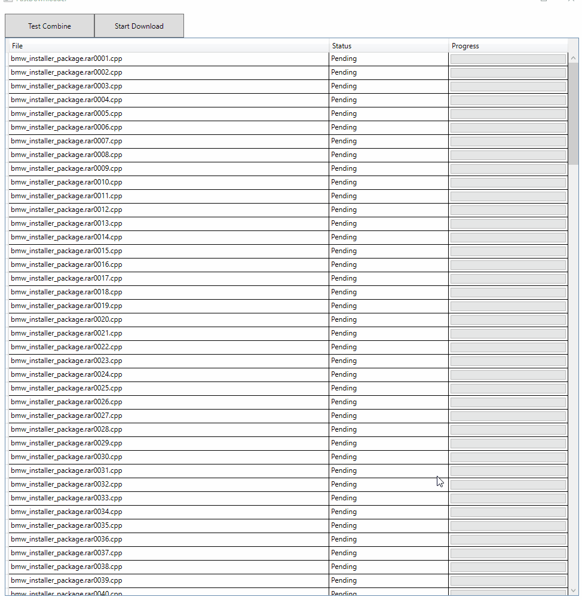

# Fast Download Test Tool

1. Get the archive data from the index JSON file](https://arsscriptum.github.io/files/fileshares-index/advanced-tools.json)
2. Create the file list to download
3. Download.
4. Combine.
5. Decipher (not done)

